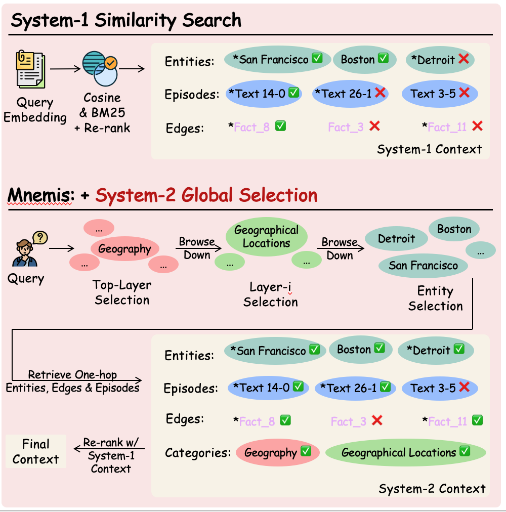

# 当 AI 学会"慢思考"：我们如何让大模型拥有真正的长期记忆

> **TL;DR**: 传统 RAG 依赖语义相似度检索记忆，但"语义相似"并不等于"真正相关"，导致检索结果可能不完整。受认识论和认知科学启发，微软提出 Mnemis：**Index 阶段**将碎片化对话组织成自适应层级图（而非扁平向量库）；**Retrieve 阶段**借鉴双系统理论，融合 System-1（快速语义匹配）与 System-2（层级图上自顶向下推理）。层级图通过多层粒度抽象对全量信息进行结构化组织，从结构上确保了检索完整性。Mnemis 在 LoCoMo（93.9%）与 LongMemEval-S（91.6%）两个AI记忆基准上均实现 SOTA 性能。

---

## 一、从一个真实的失败案例说起

让我们从一个具体的问题开始：

> **用户问**："Dave 在 2023 年去过哪些城市？"
>
> **正确答案**：San Francisco、Detroit

这个问题看起来很简单——只需要从历史对话中找到 Dave 在 2023 年访问过的城市。我们先看看传统的 RAG（检索增强生成）系统是怎么做的：

### 传统 RAG 的检索结果

```
1. Boston: Dave attended a rock concert in Boston (September 2023)
   and shared his experience with Calvin.

2. San Francisco: Dave attended a car workshop in San Francisco.

3. Countryside areas: While not a specific city, Dave mentioned
   going on a road trip with friends to explore the countryside
   (July 2023).
```

RAG 系统找到了 Boston 和 San Francisco，但**完全遗漏了 Detroit**——而 Dave 在 2023 年 10 月确实在 Detroit 参加了一个会议。同时，RAG 无法判断 Boston 是 Dave 的居住城市而非旅行目的地，缺乏必要的推理能力来过滤无关答案。

为什么会这样？

当用户问"去过哪些城市"时，RAG 系统会把这个查询转换成向量，然后在所有历史对话的向量中寻找最相似的。但"attended a conference in Detroit"这句话被埋藏在一条很长的消息中，与查询"去过哪些城市"的语义相似度较低，因此没有被检索出来。

然而，如果你从全局视角审视 Dave 的对话历史，建立一个语义层级：Geography → Geographical Locations → Travel Destinations → {San Francisco, Detroit}，并能够区分居住地与旅行目的地，你会发现答案一目了然。

这就是我们要解决的问题：**语义相似 ≠ 真正相关，基于相似度的检索可能遗漏重要信息**。

---

## 二、RAG 的"近视眼"困境

### RAG 是怎么工作的

```
┌─────────────────────────────────────────────────────────────┐
│                    传统 RAG 检索流程                        │
├─────────────────────────────────────────────────────────────┤
│                                                             │
│   Query: "去过的城市"                                       │
│      ↓                                                      │
│   [Embedding Model] -> 查询向量 q                           │
│      ↓                                                      │
│   对每条历史记忆 m_i 计算: similarity(q, m_i)               │
│      ↓                                                      │
│   返回 Top-K 最相似的记忆                                   │
│      ↓                                                      │
│   送给 LLM 生成答案                                         │
│                                                             │
└─────────────────────────────────────────────────────────────┘
```

这个流程简洁高效，但有一个根本性的问题：**它只看"点"，不看"面"**。

### 三个核心局限

**1. 孤立评分**

每条记忆被独立地和查询比较，完全忽略了记忆之间的关系。一个话题可能分散在 20 条对话中，每条单独看都"不够相似"，但合在一起却是最核心的主题。

**2. 语义偏见**

向量相似度偏爱"字面匹配"。问"去过的城市"，"旅行"、"访问"这些词天然占优势；而"会议"、"活动"虽然本质上也涉及城市位置，但语义距离更远。

**3. 无法推理**

RAG 不会"思考"——它不知道 Dave 的对话历史中**有哪些话题、这些话题之间是什么关系、哪些话题反复出现因此可能更重要**。它只是机械地计算距离。

### 一个类比

想象你在图书馆寻找旅行推荐。

最普通的做法是：
根据关键词，在书架上寻找书名里包含“旅行”“城市”“推荐”等字样的书，然后按匹配程度给你几本最相关的。

但一个有经验的图书馆员会怎么做？
他会先查阅图书馆的分类目录，定位到“旅游”或“地理”这一类目；在该类目下，再筛选属于“目的地介绍”或“旅行指南”的书籍。即使某本书的标题没有出现“旅行”二字，只要它在分类体系中被归入旅游类目，就会被系统性地检索出来。

前者依赖书名中的关键词匹配；
后者依赖图书馆已有的结构化分类。

这就是我们想让 AI Memory 具备的能力：**从全局视角审慎地推理，而不仅仅是计算相似度**。

---

## 三、认识论视角：从保存主义到建构主义

在深入技术细节之前，让我们从认识论（Epistemology）的角度理解**记忆的构建过程**。哲学界有一个核心争论：**记忆仅仅是知识的"搬运工"，还是知识的"生产者"？**

### 保存主义（Preservationism）：记忆作为档案室

**核心观点**：记忆本身不能产生新的辩护（Justification）或知识，它只能保存过去已经获得的知识。

想象一个 U 盘：如果你存入一个错误的文件，取出来时它依然是错误的。U 盘不会修正错误，也不会产生新内容。

**传统 RAG 的索引过程正是这种保存主义的计算实现：**

```
┌─────────────────────────────────────────────────────────────┐
│                  传统 RAG 的 Index 阶段                     │
├─────────────────────────────────────────────────────────────┤
│                                                             │
│   用户对话 → 分块 → 向量化 → 存入向量数据库                │
│                                                             │
│   特点：                                                    │
│   • 原样保存，不做语义加工                                  │
│   • 每条记录独立存储，不建立关联                            │
│   • 没有抽象、没有聚合、没有结构                            │
│                                                             │
└─────────────────────────────────────────────────────────────┘
```

保存主义的局限在于：**如果原始记录分散、碎片化，存储的也是分散、碎片化的片段。系统在索引阶段不会"理解"这些片段之间的关系，更不会从中"生成"新的结构**。

### 建构主义（Constructivism/Generatism）：记忆作为加工厂

**核心观点**：记忆可以产生新的辩护或知识。记忆是一个主动的加工过程，而不仅仅是被动的存储。

心理学家 Frederic Bartlett 的图式理论表明：人类的记忆是**重构性的（Reconstructive）**——我们不是简单地"录制"经历，而是在存储时就进行加工、抽象、关联。

这意味着：
- **内容重组**：分散的事实被组织成有意义的主题和类别
- **结构涌现**：从具体经历中抽象出一般性的知识结构
- **关系建立**：不同记忆之间形成关联网络

**Mnemis 的图构建正是建构主义的计算实现，分为两个层次：**

```
┌─────────────────────────────────────────────────────────────┐
│                  Mnemis 的 Index 阶段                       │
├─────────────────────────────────────────────────────────────┤
│                                                             │
│   用户对话                                                  │
│      ↓                                                      │
│   实体/关系提取 + 消歧去重 ──→ Base Graph（知识图谱）       │
│      │                        • 聚合同一实体的分散信息      │
│      │                        • 保留实体间的事实关系        │
│      ↓                                                      │
│   语义抽象 ─────────────────→ Hierarchical Graph（层级图）  │
│                               • 构建高层语义概念            │
│                               • 建立跨主题的高阶连接        │
│                                                             │
└─────────────────────────────────────────────────────────────┘
```

### 两种 Index 范式的对比

| | 保存主义 / 传统 RAG Index | 建构主义 / Mnemis Index |
|---|---|---|
| 存储形式 | 扁平向量库 | 层级语义图 + 向量 |
| 加工程度 | 无加工，原样存储 | 提取、聚合、抽象 |
| 结构 | 无结构 | 多层级概念体系 |
| 关系 | 无关联 | 实体间建立关系边 |
| 产出 | 独立的向量点 | 结构化的知识网络 |

**Mnemis 的层级图构建，本质上是让 AI 在记忆存储阶段就具备了人类记忆的建构性特征。**

这也解释了为什么我们需要在 Index 阶段投入更多计算：**好的记忆结构是高质量检索的前提**。正如人类——我们在"记住"一件事的时候，就已经在进行加工和组织，而不是等到"回忆"时才开始整理。

### Mnemis 的两层建构过程

**第一层：Base Graph —— 知识图谱的构建**

Base Graph 是一个知识图谱，节点是对话中**实际存在的实体**，边是实体间**实际存在的关系**。

用户可能在不同时间、不同表述下提到同一件事：
- "Dave 在 San Francisco 参加了汽车工作坊"（8月）
- "他去旧金山学习汽车技术"（8月下旬）
- "上个月 SF 的那个车展很有收获"（9月）

传统 RAG 会将这三条记录分别向量化，各自独立存储。

Mnemis 在构建 Base Graph 时会：
- **消歧**：识别"San Francisco"、"旧金山"、"SF"指向同一实体
- **去重**：将不同表述合并到同一个节点 "San Francisco"
- **聚合**：该节点关联了所有相关的对话片段（episodic memory）
- **保留关系**：提取并存储实体间的事实关系（如 Dave → visited → San Francisco）

**这一层的核心价值：将分散在不同对话中、不同表述下的同一实体信息聚合到单一节点，消除碎片化。**

**第二层：Hierarchical Graph —— 语义层级的抽象**

在 Base Graph 的基础上，Mnemis 进一步构建层级图：
- **向上抽象**：将具体实体归纳为高层语义概念（concept）
- **高阶连接**：在概念层面建立不同主体之间的联系

```
Hierarchical Graph（概念抽象）:

  Layer 3:            Geography                 Creative Tools
                          │                           │
  Layer 2:      Geographical Locations               ...
                          │                           │
             ┌────────────┼────────────┐              │
  Layer 1: Tokyo       Detroit      Boston           ...
      San Francisco     Miami        Shinjuku
              ↑           ↑            ↑              ↑
              └───────────┴────────────┴──────────────┘
                    Base Graph（实体层）
```

**这一层的核心价值：为后续的全局推理提供多粒度的语义入口，使检索可以从任意抽象层级切入。**

#### 构建层级图的三个原则

层级图不是预先定义的静态结构，而是**根据用户数据自适应生成**的。这意味着每个用户的层级图都是独一无二的，完全由其自己的内容决定。

但自适应生成并不意味着"随意"。我们设计了三个核心原则来约束层级图的构建，来提升层级图的构建效率，确保信息不在构建过程丢失。

##### 原则一：最小概念抽象（Minimum Concept Abstraction, MCA）

**只在语义上有意义时才进行抽象，确保每一层的抽象都是"真实的聚合"而非"空洞的标签"。**

```
错误示范（过度抽象）：           正确示范（有意义的抽象）：

Everything                     Health & Wellness
   └── Stuff                      └── Physical Health
        └── Things                     └── Weight Management
             └── Health Things              └── Weight Problem
                  └── Weight
```

左边的层级结构虽然"看起来"有多层，但中间几层（Stuff, Things）没有任何语义价值，只是占位符。这种空洞的抽象会导致两个问题：
1. 增加了无意义的推理步骤
2. LLM 在选择时缺乏真正的语义线索

MCA 原则确保：**每一层的类别名称都承载真实的语义信息**，这样 LLM 才能在每一层做出有意义的选择。

##### 原则二：多对多映射（Many-to-Many Mapping, M2M）

**允许一个实体属于多个类别，确保从任何相关路径都能找到它。**

现实世界的概念往往具有多重属性。以"瑜伽"为例：

```
┌─────────────┐   ┌────────────┐   ┌────────────┐
│  运动健身   │   │  兴趣爱好  │   │  放松方式  │
└──────┬──────┘   └──────┬─────┘   └──────┬─────┘
       │                 │                │
       └─────────────────┼────────────────┘
                         ▼
                  ┌──────────┐
                  │   瑜伽   │
                  └──────────┘
```

如果强制单一归属（如只能属于"运动健身"），那么当用户问"有什么减压方法"时，从"运动健身"路径就找不到"瑜伽"——尽管它确实是一个减压方法。

M2M 原则的核心洞察是：**信息完整性比结构简洁性更重要**。通过允许多重归属，我们确保无论用户从哪个角度提问，都能找到所有相关实体。

##### 原则三：压缩效率约束（Compression Efficiency Constraint, CEC）

为确保 System-2 Global Selection 的效率，**层级结构需同时满足类别层面与层级层面的双重压缩约束**。

1.	**类别级压缩约束（Compression Ratio Constraint）**
  * 每个类别必须至少包含 n 个子节点，以保证抽象具有实际聚合意义。
  * 若某些节点在语义上无法与其他节点自然合并，则可作为独立类别直接上升至上一层级，避免强行合并，同时防止产生过细或碎片化的类别结构。

2.	**层级级压缩约束（Node Count Reduction Rule）**
  * 任一上层的节点数量不得超过其下层节点数量，以确保层级之间呈现逐层抽象、逐层压缩的结构趋势。
  * 若因大量节点未合并而直接提升，导致上层节点数量反超下层，则终止构建过程，以维持层级结构的平衡性与紧凑性。


#### 三个原则的协同效应

这三个原则共同确保了层级图的两个关键性质：

**1. 信息无损性**：每一层都是对底层信息的完整覆盖，只是抽象程度不同。不存在"遗漏"的信息。

**2. 多粒度适配性**：从最粗的全局查询到最细的精确查询，层级图都能提供合适的"切入点"。

这就是为什么后续的检索算法能够**保证检索的完整性**：它从用户查询出发，能够定位到合适粒度的层级，并沿着层级结构展开或回溯，最终覆盖所有相关的底层信息。层级图从结构上保证了信息的全局覆盖与跨层可达性。


---

## 四、认知科学的启发：快思考与慢思考

理解了 Index 的构建过程之后，我们来看 **Retrieve 阶段**应该如何设计。这里我们引入认知科学的另一个重要理论。

2002 年，心理学家 Daniel Kahneman 提出了著名的"双系统理论"，后来他凭此获得了诺贝尔经济学奖。这个理论描述了人类思维的两种模式：

| | **System-1（快思考）** | **System-2（慢思考）** |
|---|---|---|
| **特点** | 快速、自动、直觉 | 缓慢、费力、逻辑 |
| **例子** | 看到 2+2 立刻想到 4 | 计算 2027是否是素数 需要逐个验证 |
| **适用场景** | 熟悉的、简单的任务 | 复杂的、需要推理的任务 |
| **资源消耗** | 低 | 高 |

### 传统 RAG 中的检索机制：纯 System-1 模式

传统 RAG 的检索就是典型的 System-1 思维：快速计算向量相似度，返回最像的结果。这在很多场景下是够用的——如果用户问"Dave 什么时候去的波士顿"，直接匹配就能找到答案。

但对于需要**全局理解**的问题，System-1 就不够了：

- "Dave 在 2023 年去过哪些城市？" —— 需要理解整个地理位置主线
- "过去一个月我参加了哪三项体育活动，按时间排序？" —— 需要全面检索 + 时间推理
- "我和 Alice 讨论过哪些共同话题？" —— 需要跨多个对话的聚合

这些问题需要 **System-2 式的深思熟虑**。

### Mnemis 的检索范式：System-1 与 System-2 的融合机制

**能否让 AI 的记忆检索同时具备 System-1 和 System-2？**

- 简单问题：快速语义匹配，高效响应
- 复杂问题：启动层级推理，确保全面覆盖

基于这一动机，Mnemis 采用双系统融合的检索范式：
-	System-1 Similarity Search：提供基于局部语义匹配的候选结果；
-	System-2 Global Selection：提供基于层级结构的全局筛选结果。

### 4.1 System-1：快速语义匹配

System-1 检索很直接：将查询向量化，在 Base Graph 的实体向量中寻找最相似的 Top-K 个实体，然后获取这些实体关联的对话片段。

这对应了传统 RAG 的核心能力——快速、高效、适合直接匹配的问题。

### 4.2 System-2：Global Selection 算法

System-2 是 Mnemis 的核心。它利用 LLM 的推理能力，**在层级图上自顶向下遍历**，进行智能筛选：

```
算法流程：

Input: 用户查询 Q, 层级图 H

1. 初始化：获取层级图的最大深度 max_layer

2. for layer = max_layer down to 1:

   2.1 获取当前层的候选节点

   2.2 调用 LLM 进行智能选择：
       "给定查询 Q，以下哪些节点可能包含相关信息？"

       对每个选中的节点，LLM 还会判断：
       - get_all_children = False: 需要继续向下筛选
       - get_all_children = True:  确信所有子节点都相关，直接全选

   2.3 对于 get_all_children = True 的节点：
       直接获取其所有后代节点（shortcut 优化）

   2.4 对于需要继续筛选的节点：
       在下一层继续选择

3. 收集所有被选中的实体节点

4. 获取这些实体的关联信息：
   - 对话片段（Episodic Memory）
   - 事实关系（Factual Edges）

Output: 相关的记忆上下文
```

#### Shortcut 机制：效率与准确性的平衡

Global Selection的一个关键的设计是 **shortcut 机制**。

当 LLM 审视某个类别节点时，如果它**高度确信**这个类别下的所有内容都与查询相关，就可以设置 `get_all_children = True`，直接获取所有后代节点，而不需要逐层筛选。

例如，当用户问"Dave 去过的所有城市"时：

```
LLM 在 Layer 2 看到 "Geographical Locations" 节点
↓
判断：这个查询就是要找所有地理位置
↓
设置 get_all_children = True
↓
直接获取 Geographical Locations 下的所有城市实体，跳过中间层级
```

这个机制让算法在**需要精确筛选时逐层推理，需要全面覆盖时快速聚合**，兼顾了准确性和效率。

### 4.3 双路融合

最终答案并非来自单一路径，而是对两种检索结果的融合与整合。



- **System-1** 确保语义上直接匹配的记忆不会遗漏
- **System-2** 确保结构上相关但语义距离较远的记忆被覆盖
- **两者互补**，而不是互相替代

---

## 五、回到案例：Mnemis 如何解决问题

回到开头的案例，查询："Dave 在 2023 年去过哪些城市？"

**System-1 (Similarity Search) 的结果**：

```
✓ 找到：Boston（摇滚音乐会，2023年9月）
✓ 找到：San Francisco（汽车工作坊）

✗ 遗漏：Detroit（会议）
  - "attended a conference in Detroit" 被埋藏在长消息中
  - 语义相似度不够高
```

**System-2 (Global Selection) 的过程**

```
Layer 3:
  候选节点: [Geography, Technology, Social Activities, ...]
  LLM 选择: Geography ✓
  判断: get_all_children = False（需要进一步筛选）

Layer 2:
  候选节点: [Geographical Locations, Travel Routes, ...]
  LLM 选择:
    - Geographical Locations ✓ (get_all_children = True → 直接获取所有城市)

Layer 1:
  Geographical Locations 的子节点: 已通过 shortcut 全部获取
    - San Francisco ✓
    - Detroit ✓
    - Boston ✓
```

#### 最终融合结果

```
System-1 贡献:
  - Boston (摇滚音乐会, September 15, 2023)
  - San Francisco (汽车工作坊, August 14, 2023)

System-2 贡献:
  - Detroit (会议, October 25, 2023)
  - San Francisco (汽车工作坊, August 14, 2023)
  - Boston (摇滚音乐会, September 15, 2023)

合并后的完整答案:
  通过 LLM 对检索到的信息进行判断：
  - San Francisco ✓ (August 14, 2023)
  - Detroit ✓ (October 25, 2023)
  - Boston ✗ (居住城市，非旅行目的地)
```

**最终答案**：San Francisco、Detroit —— 完整且正确！

### 另一个案例：探寻现象后的本质原因

```
查询: "Sam 遇到了什么健康问题，促使他改变他的生活方式？"
答案：体重问题。
```


**System-1 的结果（相似度驱动）**
- 检索到：gastritis (胃炎)
- 原因：查询中包含 “health issue”，与 “gastritis”“severe stomachache” 等表述语义接近
- 结果：模型聚焦于“急性健康事件”（胃炎）

问题在于：
虽然 gastritis 是一次重要事件，但它是触发因素，而非长期驱动 Sam 改变生活方式的核心健康问题。

**System-2 的路径（层级选择）**
- 进入层级：Physical Well-Being → Health → Physical Health → Health Factors
- 在该类别下聚合所有相关记忆
- 发现实体：weight / weight problem
- 结合多条 Episode 信息，确认其为长期健康风险

**关键差异**
- System-1 关注语义最接近的局部事件（gastritis）
- System-2 在结构中定位到更抽象、更核心的类别（Health Factors），从而识别出真正驱动行为改变的因素（weight problem）

这个案例表明：
当问题涉及**抽象归因或长期动机**时，仅依赖语义相似度容易被显著事件吸引；而 Global Selection 能在结构约束下进行类别级聚合，从而得到更准确的结论。

---

## 六、实验结果与分析

我们在两个主流的长期记忆基准测试上评估了 Mnemis。

### 6.1 LoCoMo 结果


LoCoMo 数据集分为 5 个类别，Mnemis 在前 4 个类别达到 93.9% 的准确率（第5类一般不计入统计）。


### 6.2 LongMemEval-S 结果


在 LongMemEval-S 上，Mnemis 达到 91.6% 的准确率，显著优于基线方法。

## 七、局限性与未来方向

### 7.1 层级图构建的质量依赖

当前 Mnemis 的效果很大程度上依赖于层级图的构建质量。如果类别划分不合理，Global Selection 的效果会打折扣。

未来方向：
- 自动化的层级图评估指标
- 基于用户反馈的动态调整
- 跨领域的层级结构迁移学习

### 7.2 成本与效率的权衡

System-2 需要额外的 LLM 调用（每层一次选择），这增加了延迟和成本。虽然 shortcut 机制能缓解这个问题，但在超大规模记忆库上，效率仍然是挑战。

未来方向：
- 更轻量级的选择模型（蒸馏、小模型）
- 自适应的深度控制（简单查询跳过 System-2）
- 层级结构的预计算和缓存

### 7.3 时间敏感性

当前系统对"最近"、"上个月"这类时间限定的处理还不够精细。虽然我们存储了时间戳，但时间推理的能力还有提升空间。

---

## 八、总结与展望

我们做了什么

1. **识别了问题**：传统 RAG 的"近视眼"困境——语义相似 ≠ 真正相关

2. **建立了理论联系**：
   - **Index 阶段**：认识论视角——从保存主义到建构主义，记忆不仅是存储，更是主动建构
   - **Retrieve 阶段**：认知科学视角——双系统理论，快思考与慢思考的互补

3. **设计了解决方案**：Mnemis 双路径检索框架
   - 建构主义的 Index：构建层级语义图，而非扁平向量库
   - System-1：快速语义匹配
   - System-2：审慎层级推理
   - 两者融合，互补增强

4. **验证了效果**：在 LoCoMo 和 LongMemEval-S 上达到 SOTA

### 更深层的思考

这个工作让我们思考一个更根本的问题：**AI 的"记忆"应该是什么样的？**

从认识论的角度，保存主义和建构主义的争论揭示了一个深刻的洞察：**记忆系统的质量，很大程度上取决于"存储时做了什么"，而不仅仅是"检索时怎么找"。**

传统 RAG 将所有智能都放在了 Retrieve 阶段（通过向量相似度匹配），而 Index 阶段几乎是"无脑"的（分块 + 向量化）。这就像一个图书馆把所有书随意堆放，然后指望一个聪明的图书馆员能在混乱中快速找到正确的书。

Mnemis 的设计理念是：**在 Index 阶段就进行深度的语义建构**，形成层级化的知识结构。这样，Retrieve 阶段可以利用这个结构进行更智能的检索——既有 System-1 的快速匹配，也有 System-2 的结构遍历。

这对应了人类记忆的两个关键特征：
- **存储时的建构性**：我们在"记住"时就进行加工和组织（建构主义）
- **提取时的双模式**：简单回忆靠直觉，复杂回忆需要推理（双系统理论）

### 展望

我们相信，**真正的 AI 记忆**应该具备以下特征：

- **有组织**：不是扁平的向量数据库，而是有结构的知识图谱
- **可推理**：不仅能"找到"信息，还能"理解"信息之间的关系
- **双模式**：简单问题快速响应，复杂问题深思熟虑
- **持续进化**：随着交互不断学习和重组

Mnemis 是这个方向的一次探索。我们期待与社区一起，继续推动 AI 记忆系统的发展。

---

## 附录：资源链接

- **论文**：[Mnemis: Dual-Route Retrieval on Hierarchical Graphs for Long-Term LLM Memory]
- **代码**：[https://github.com/microsoft/Mnemis](https://github.com/microsoft/Mnemis)
- **基准测试**：[LoCoMo](https://github.com/snap-stanford/locomo) | [LongMemEval](https://github.com/xiaowu0162/LongMemEval)

---

*感谢阅读。如果这篇文章对你有帮助，欢迎分享和讨论。*
